# Northwind-Business-Intelligence
Business Intelligence solution built on the Northwind database featuring a Snowflake Data Warehouse, SSIS ETL pipelines, SSAS Multidimensional OLAP Cube, dimensional modeling, and Excel-based analytical reporting.
# 🚀 Northwind Business Intelligence

<p align="center">


</p>

---

# 📌 Project Overview

This project demonstrates the complete implementation of a **Business Intelligence solution** based on the **Northwind** database using Microsoft's BI stack.

The project covers the entire BI workflow, including:

* Designing a Snowflake Data Warehouse
* Building ETL packages with SSIS
* Developing a Multidimensional OLAP Cube using SSAS
* Performing analytical reporting through Excel Pivot Analysis

Unlike a traditional database project, the objective was to transform transactional data into an analytical model optimized for reporting and decision-making.

---

# 🏛 Solution Architecture

The overall Business Intelligence architecture is illustrated below.

<p align="center">
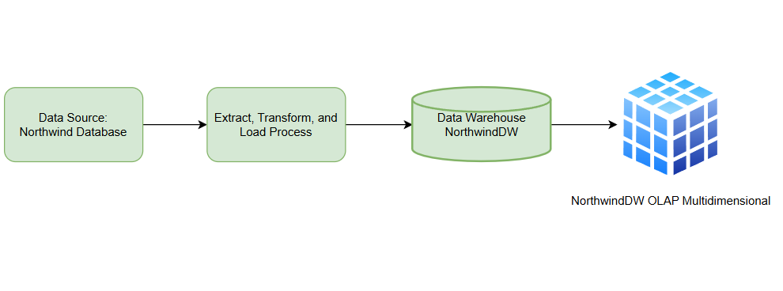
</p>

---

# ❄ Data Warehouse Design

The analytical model follows a **Snowflake Schema**.

The schema consists of:

## Dimension Tables

* DimCustomers
* DimDate
* DimEmployee
* DimGeography
* DimProducts
* DimShippers
* DimSuppliers

## Fact Table

* FactOrders

The Snowflake design was selected because several dimensions (such as **Suppliers**) are naturally related through another dimension before reaching the Fact table, reducing redundancy while preserving hierarchical relationships.

<p align="center">
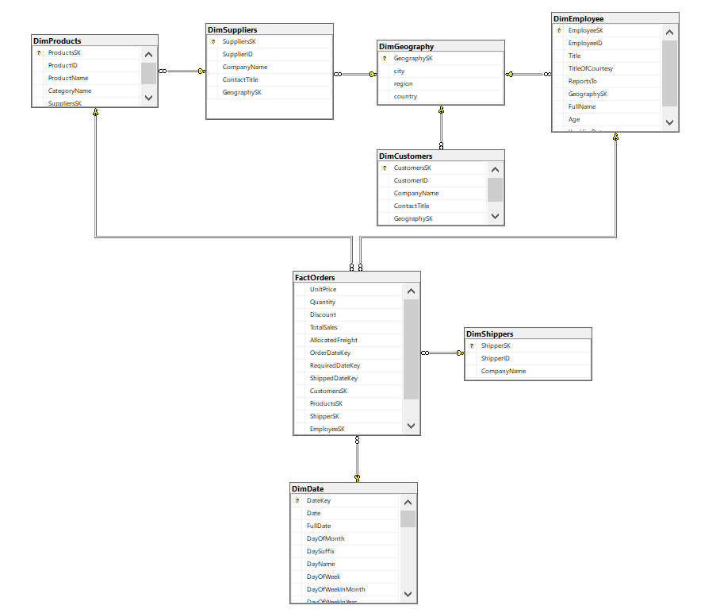
</p>

---

# 📊 Fact Table Design

## FactOrders

The grain of the Fact table is:

> **One record per order line.**

Instead of loading Orders and Order Details separately, both OLTP tables were integrated into a single analytical Fact table.

### Measures

* UnitPrice
* Quantity
* Discount
* TotalSales
* AllocatedFreight

### Foreign Keys

* OrderDateKey
* RequiredDateKey
* ShippedDateKey
* CustomersSK
* ProductsSK
* ShipperSK
* EmployeeSK
* GeographySK

---

# 🔄 ETL Process

The ETL pipeline was implemented using **SQL Server Integration Services (SSIS).**

A **Full Load** strategy was used throughout the project.

The destination tables are refreshed before each execution to ensure data consistency.

## Components Used

* OLE DB Source
* OLE DB Destination
* Lookup
* Merge Join
* Sort
* Derived Column

<p align="center">
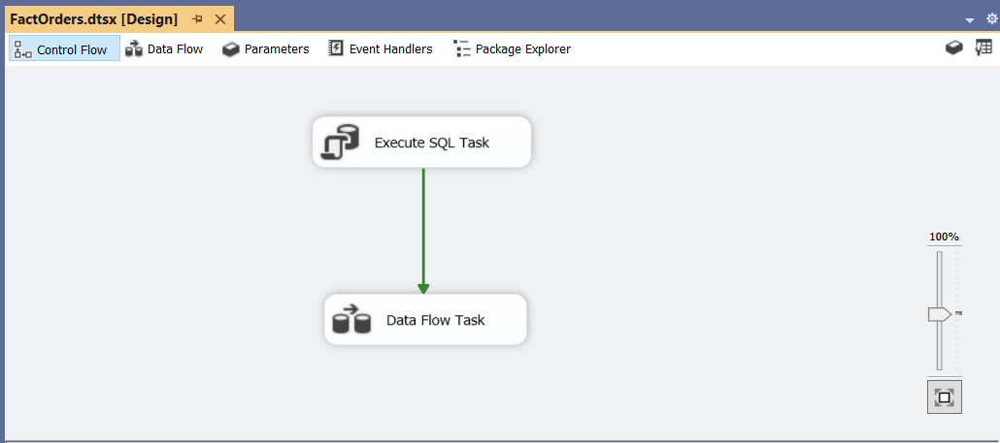
</p>

---

# 🔑 Surrogate Keys

Every Dimension table was designed using **Surrogate Keys**.

The Fact table retrieves Dimension keys using Lookup transformations for:

* Customer
* Product
* Employee
* Geography
* Shipper
* Date

This follows dimensional modeling best practices and keeps the analytical model independent from OLTP primary keys.

---

# 🔧 Data Transformations

Several business attributes were generated during ETL.

## DimEmployee

Using Derived Column transformations, the following attributes were created:

* FullName
* Age
* YearHireDate

<p align="center">
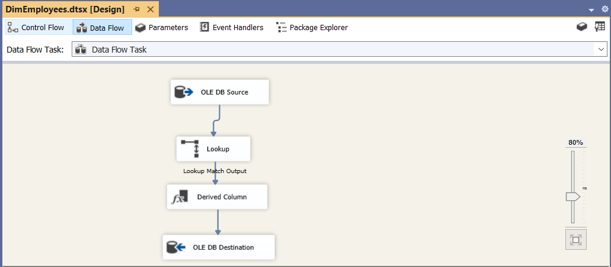
</p>

---

## FactOrders

The Fact table was produced by joining:

* Orders
* Order Details

using the **Merge Join** transformation.

This created a single analytical Fact table instead of maintaining multiple transactional tables.

<p align="center">
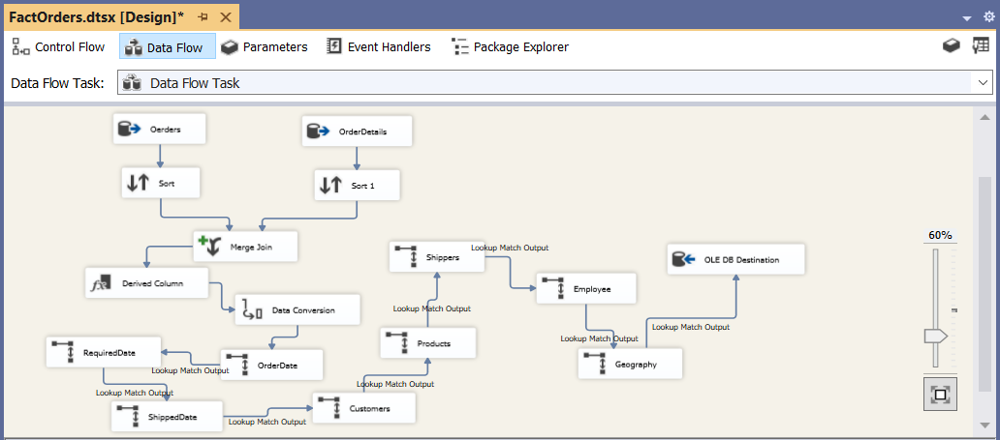
</p>

---

# 🧠 SSAS Multidimensional Model

A Multidimensional Cube named:

> **North Wind DW**

was developed using SQL Server Analysis Services.

The cube contains:

* 7 Dimensions
* 1 Measure Group (FactOrders)

---

# 📂 Cube Structure

<p align="center">
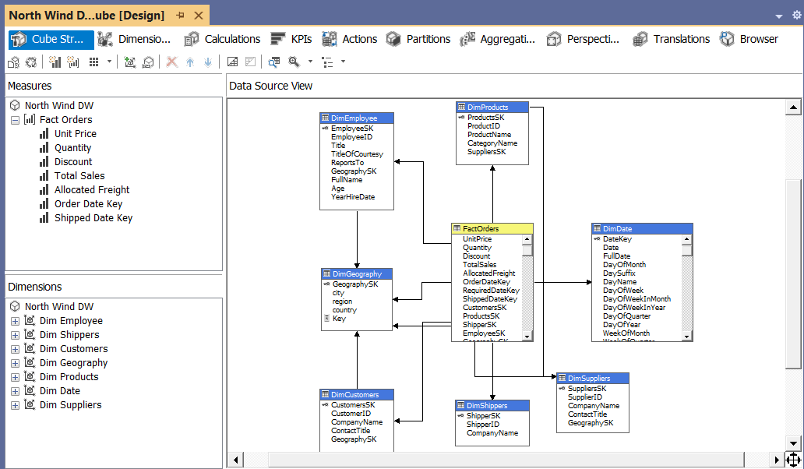
</p>

---

# 🧩 Dimension Usage

The relationship between the Fact table and all Dimensions was configured inside the cube.

<p align="center">
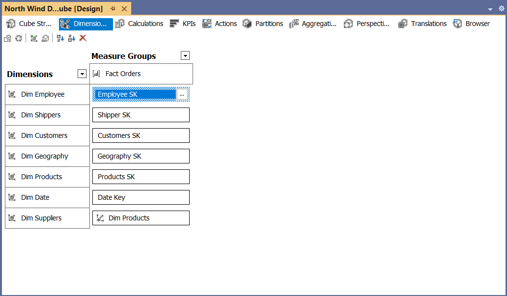
</p>

---

# 📅 Date Hierarchy

A user hierarchy was created for Date.

Year

↓

Quarter

↓

Month

<p align="center">
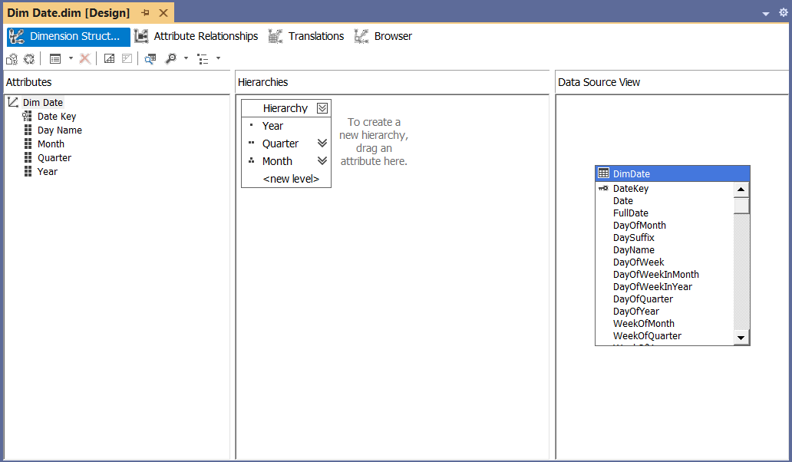
</p>

---

# 🌍 Geography Hierarchy

Country

↓

Region

↓

City

<p align="center">
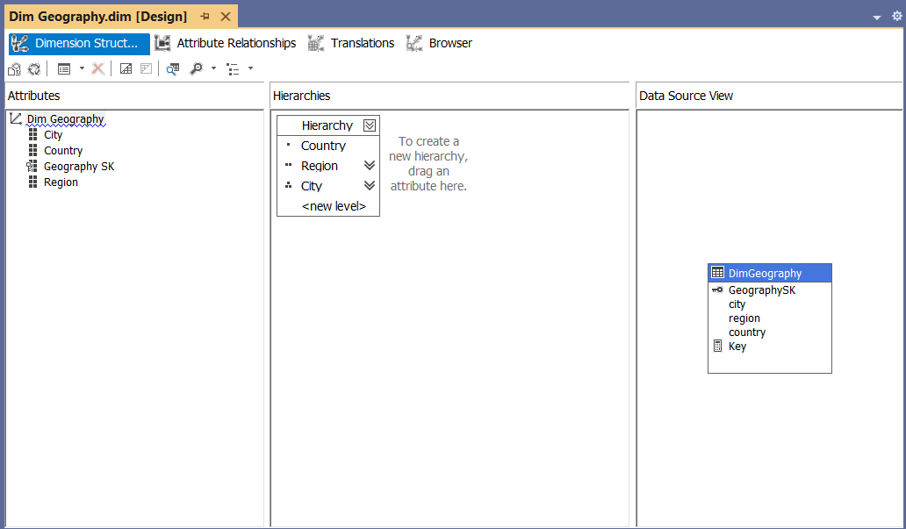
</p>

---

# 🔗 Attribute Relationships

To improve cube performance, Attribute Relationships were configured.

## Date

DateKey

↓

Month

↓

Quarter

↓

Year

<p align="center">
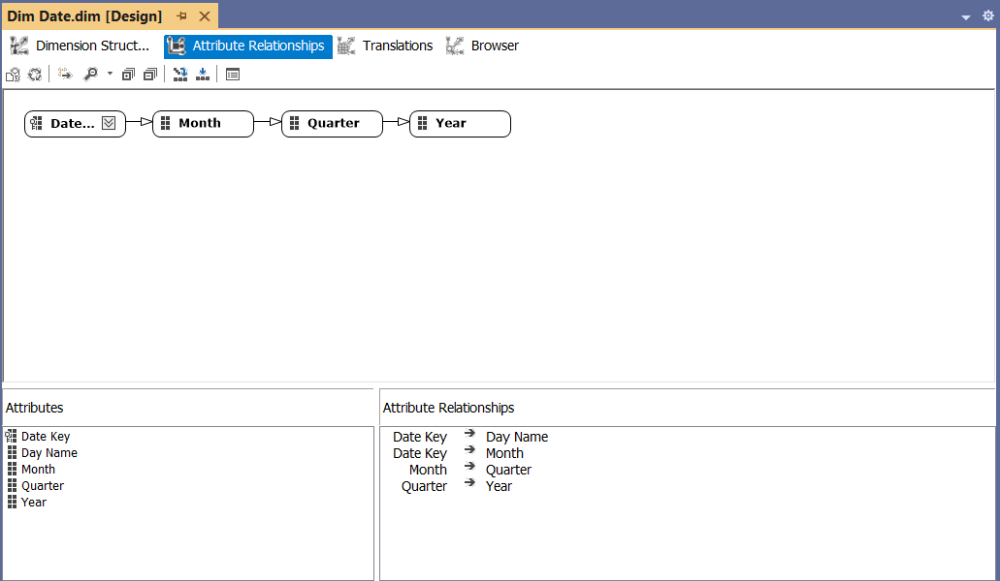
</p>

---

## Geography

GeographySK

↓

City

↓

Region

↓

Country

<p align="center">
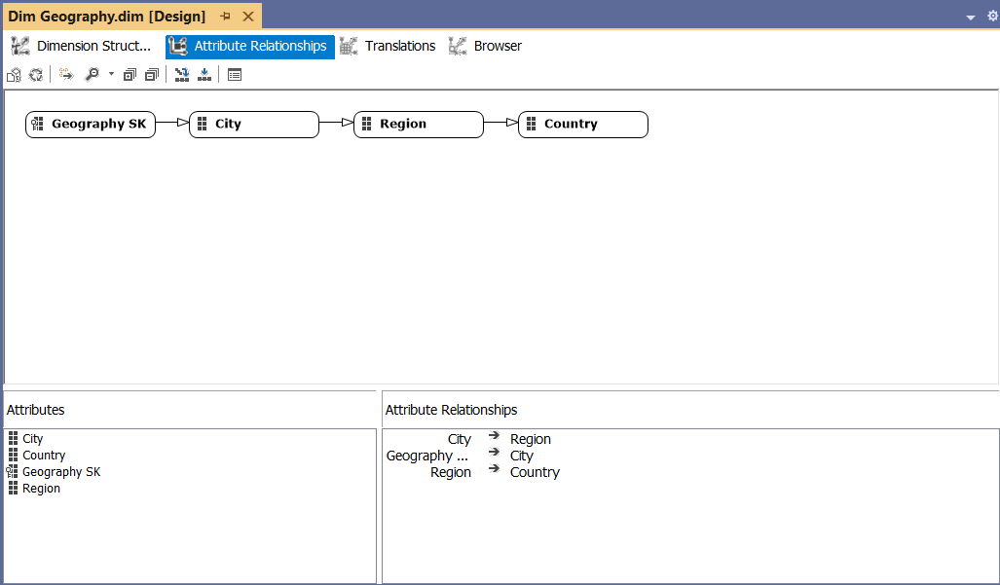
</p>

---

# 💡 Engineering Challenges

One of the most valuable parts of this project was solving several real-world BI modeling challenges.

---

## Challenge 1

### Building a single Fact table

The OLTP database stores transactional information in two separate tables:

* Orders
* Order Details

Instead of creating multiple Fact tables, both tables were merged into a single analytical Fact table using SSIS Merge Join.

This produced a cleaner dimensional model while preserving the desired analytical grain.

---

## Challenge 2

### Freight Allocation

After joining Orders with Order Details, the Freight value became duplicated for every product within the same order.

For example,

If an order contains three products,

the original Freight appears three times.

This leads to incorrect analytical results.

To solve this issue, a SQL Window Function was used to calculate the number of order lines for each order.

```sql
SELECT *,
       COUNT(ProductID) OVER(PARTITION BY OrderID) AS LineCount
FROM [Order Details]
```

The Freight value was then distributed across all order lines using a Derived Column transformation.

```
AllocatedFreight = Freight / LineCount
```

This guarantees that Freight is counted only once at the order level while remaining fully additive inside the Fact table.

---

## Challenge 3

### Composite Key Columns

Month names and Quarter names naturally repeat every year.

Because of this, SSAS cannot uniquely identify them using only their captions.

To solve this issue,

Composite Key Columns were configured for the corresponding attributes before creating Attribute Relationships.

This allows SSAS to build optimized hierarchies without ambiguity.

---

# 📈 Cube Analysis

The cube was exported to Microsoft Excel for multidimensional analysis.

An example Pivot Analysis is shown below.

<p align="center">
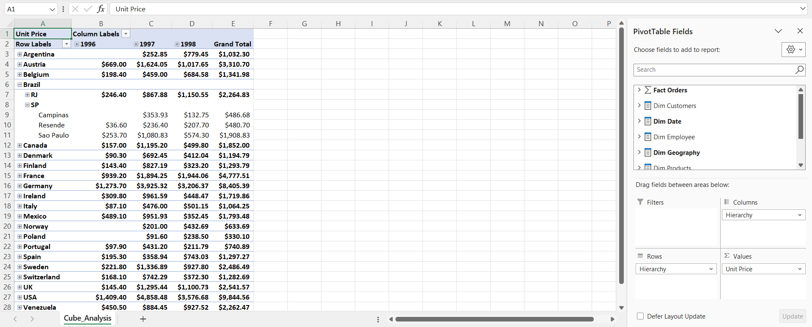
</p>

The exported workbook is available inside:

```
Analysis/Cube_Analysis.xlsx
```

---

# 🛠 Technologies Used

* Microsoft SQL Server 2022
* SQL
* T-SQL
* SQL Server Integration Services (SSIS)
* SQL Server Analysis Services (SSAS)
* Snowflake Schema
* Data Warehouse
* ETL
* Business Intelligence
* Microsoft Excel Pivot Analysis

---

# 📂 Repository Structure

```text
Northwind-Business-Intelligence
│
├── Images
│
├── SSIS
│   ├── NorthwindDW.sln
│   ├── NorthwindDW.dtproj
│   └── *.dtsx
│
├── SSAS
│
├── Analysis
│   └── Cube_Analysis.xlsx
│
├── SQL Scripts
│
└── README.md
```

---

# 📚 Lessons Learned

Through this project I gained hands-on experience in:

* Designing a Snowflake Data Warehouse
* Building ETL pipelines with SSIS
* Dimensional Modeling
* Surrogate Key implementation
* Solving duplicate measure problems in Fact tables
* Applying SQL Window Functions to support ETL logic
* Designing optimized Hierarchies
* Configuring Attribute Relationships
* Developing SSAS Multidimensional Cubes

---

# 🚀 Future Improvements

Potential future enhancements include:

* Implementing SSRS reports
* Creating KPIs inside SSAS
* Developing Perspectives
* Adding Calculated Members using MDX
* Building Power BI dashboards connected to the cube

---

If you found this project interesting, feel free to explore the repository and provide feedback.
